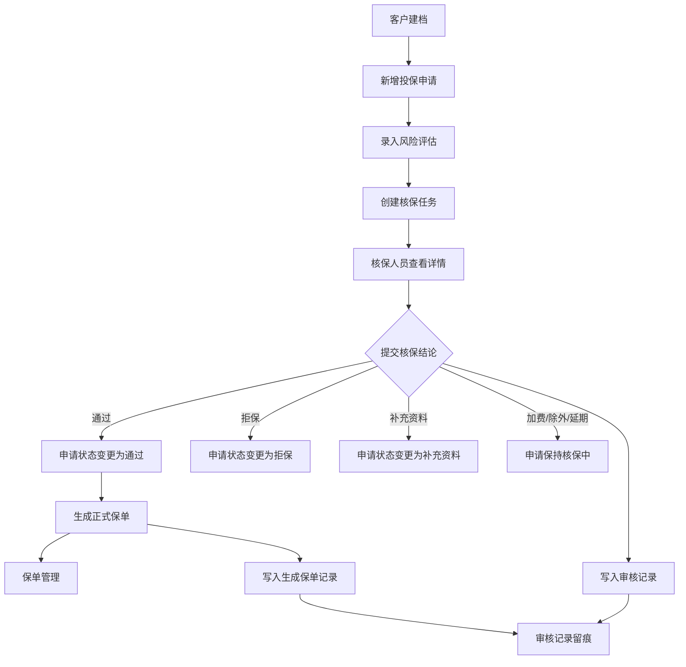
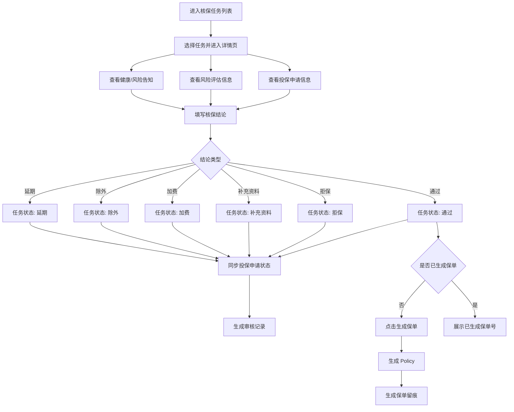
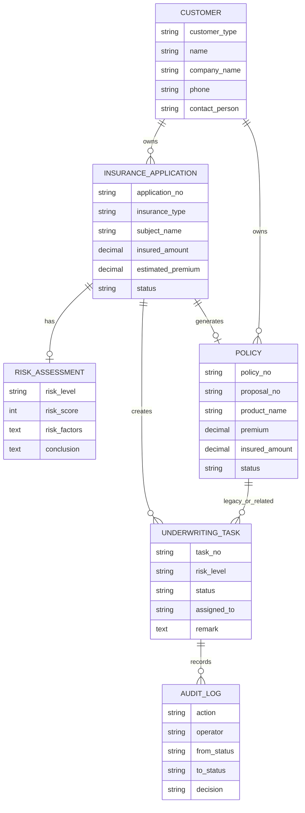
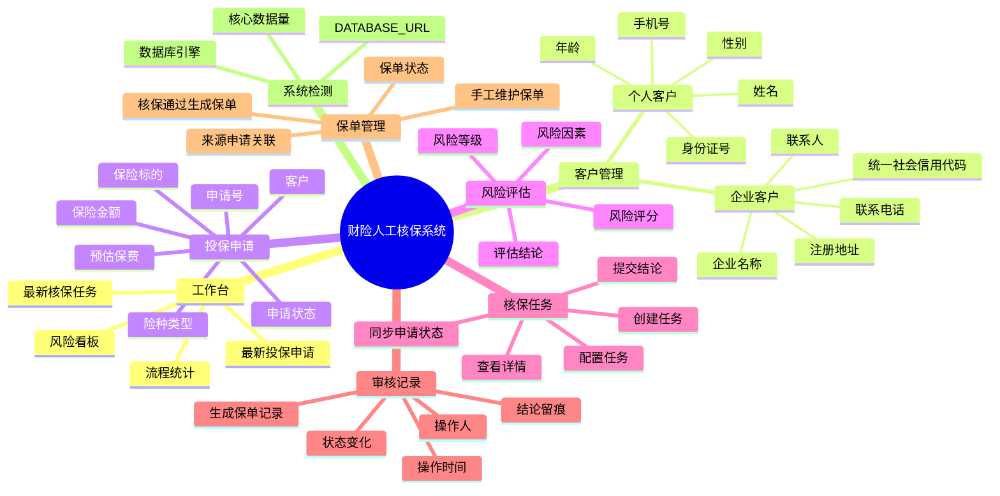
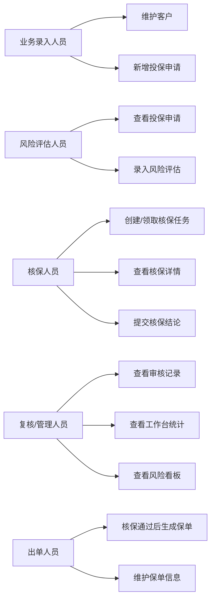

# 财险人工核保流程培训图

本文档用于培训讲解财险人工核保系统的业务流程和功能模块。

## 推荐培训版本

已新增更容易看懂的可视化 UI 版：

[打开 training_ui.html](training_ui.html)

建议培训、演示、截图时优先使用 `docs/training_ui.html`，该页面用卡片、流程箭头、角色泳道和模块矩阵表达业务流程；本文档保留 Mermaid 版本，便于技术人员维护和复制。

## 一、业务主流程图

## 二、核保任务处理流程图

## 三、数据对象关系图

## 四、功能模块脑图

## 五、角色培训视角

## 六、培训讲解顺序

1. 先讲客户：个人客户和企业客户的区别。
2. 再讲投保申请：申请是财险核保流程的业务主单。
3. 再讲风险评估：风险评估为核保任务提供输入。
4. 再讲核保任务：核保人员在详情页查看信息并提交结论。
5. 再讲审核记录：每次关键操作都会留下记录。
6. 最后讲保单生成：只有核保通过后，才从投保申请生成正式保单。
